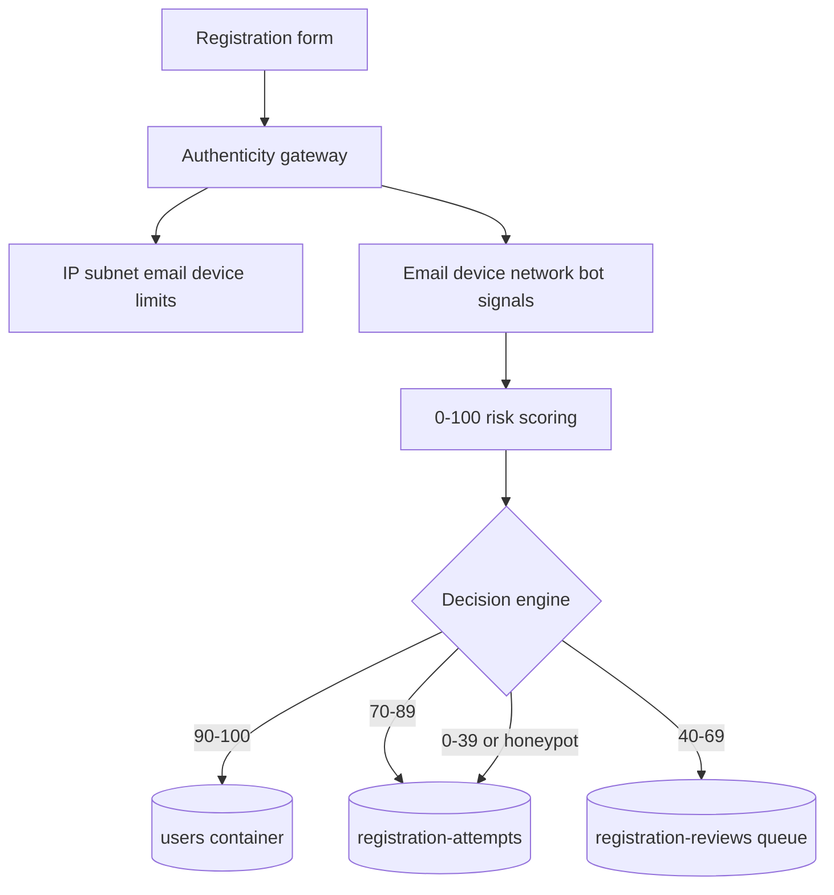

# Registration Authenticity Gateway

## Architecture

No password is written to attempts, logs, or reviews. IP addresses, email addresses, and device-derived identifiers are salted SHA-256 hashes. `users` is reached only by the trusted approval branch.

## Storage schema

`registration-attempts` stores `id`, `emailHash`, `deviceFingerprint`, `ipHash`, `trustScore`, `decision`, `failureReason`, `riskFactors`, and `createdAt`.

`registration-reviews` stores `id`, `attemptId`, `reviewer`, `decision`, `reason`, and `reviewedAt`.

`users` remains the existing permanent account container. Registration attempts use `/id` as their Cosmos partition key; reviews use `/attemptId`.

## API contracts

`POST /api/auth/register` accepts the existing registration fields plus the invisible `website` honeypot field. Browser signal headers are `user-agent`, `accept-language`, `x-timezone`, and `x-screen`.

- `201`: trusted assessment and permanent user creation.
- `202`: verification required or manual review; includes an opaque `attemptId`.
- `400`: rejected; no user is created.
- `429`: IP, subnet, email, or device limit reached.

`GET /api/admin/registration-reviews` returns the admin review queue. `POST` accepts `{ attemptId, decision, reason }` and records an audit entry. Review approval does not create an account because held requests do not retain passwords.

## Risk model

The scorer starts at 100. Disposable domains, invalid email, or a populated honeypot are hard failures. Recent attempt velocity, device reuse, automation user agents, and missing browser signals subtract points. Provider-backed MX, domain reputation, VPN/proxy/TOR, geolocation, phone, and behavioural enrichment should be added as asynchronous factors before production rollout; an unknown provider result must not increase trust.

## Security and abuse tests

The unit suite covers trusted approval, disposable email rejection, honeypot rejection, medium-confidence verification, and suspicious device review. Load tests should exercise concurrent submissions across one IP, one subnet, one email, and one device, asserting that no rejected or held request produces a `users` item. Abuse scenarios should include credential stuffing, account farming, replayed browser signals, datacentre IPs, and burst submissions.

## Deployment guidance

Set `REGISTRATION_HASH_SALT` to a strong secret in the deployment secret store. Configure `COSMOSDB_REGISTRATION_ATTEMPTS_CONTAINER` and `COSMOSDB_REGISTRATION_REVIEWS_CONTAINER` only when non-default container names are required. Add managed identity access for both containers. Put MX/reputation and network intelligence behind bounded timeouts and cache results; fail closed for hard failures and fail to review for unavailable enrichment, never directly to account creation.